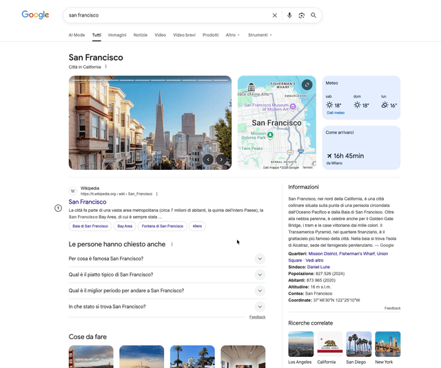

# userscripts

Userscripts I use to improve my experience on websites.

To install it, use [Tampermonkey](https://www.tampermonkey.net/) or a similar userscript manager.

## GoogleResultsKeyboardNavigation.user.js

Inspired by the [KeyNavGoogleResults](https://greasyfork.org/en/scripts/524830-keynavgoogleresults) script, it features the following features:

- Navigate Google search results using the keyboard
    - arrow down / up to move between results
    - enter to open the selected result in the current tab
    - number keys (1-9) to open the corresponding result in a new tab
    - arrow left / right to switch between results pages
    

